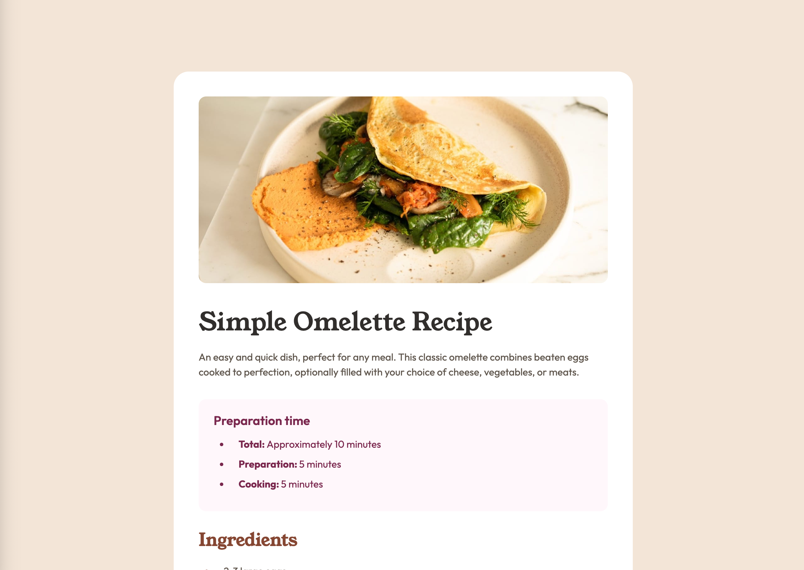

# Frontend Mentor - Recipe page solution

This is a solution to the [Recipe page challenge on Frontend Mentor](https://www.frontendmentor.io/challenges/recipe-page-KiTsR8QQKm). Frontend Mentor challenges help you improve your coding skills by building realistic projects.

## Table of contents

-   [Frontend Mentor - Recipe page solution](#frontend-mentor---recipe-page-solution)
    -   [Table of contents](#table-of-contents)
    -   [Overview](#overview)
        -   [The challenge](#the-challenge)
        -   [Screenshot](#screenshot)
        -   [Links](#links)
    -   [My process](#my-process)
        -   [Built with](#built-with)
        -   [What I learned](#what-i-learned)
        -   [Continued development](#continued-development)
    -   [Author](#author)

## Overview

### The challenge

Users should be able to:

-   See hover and focus states for all interactive elements on the page

### Screenshot

### Links

-   Solution URL: [https://github.com/EmLopezDev/Recipe-Page](https://github.com/EmLopezDev/Recipe-Page)
-   Live Site URL: [https://emlopezdev.github.io/Recipe-Page/](https://emlopezdev.github.io/Recipe-Page/)

## My process

### Built with

-   Semantic HTML5
-   CSS custom properties
-   Flexbox

### What I learned

-   Continued learning how to write more semantic HTML
-   Better organization within the CSS file. Kept it minimal. There was no need to use classnames since each tag only appeared one
-   Plan ahead for media query, focus on a mobile first approach
-   Figuring out the best approach for media queries

### Continued development

-   Will continue writing HTML until I get to a place where I have a good grasp on semantics
-   Will continue writing simple well organized CSS files
-   Will continue practicing media queries as I know they can get tricky with larger projects
-   Will continue incorporating my information into the challenges to make them more personal

## Author

-   Frontend Mentor - [@EmLopezDev](https://www.frontendmentor.io/profile/EmLopezDev)
